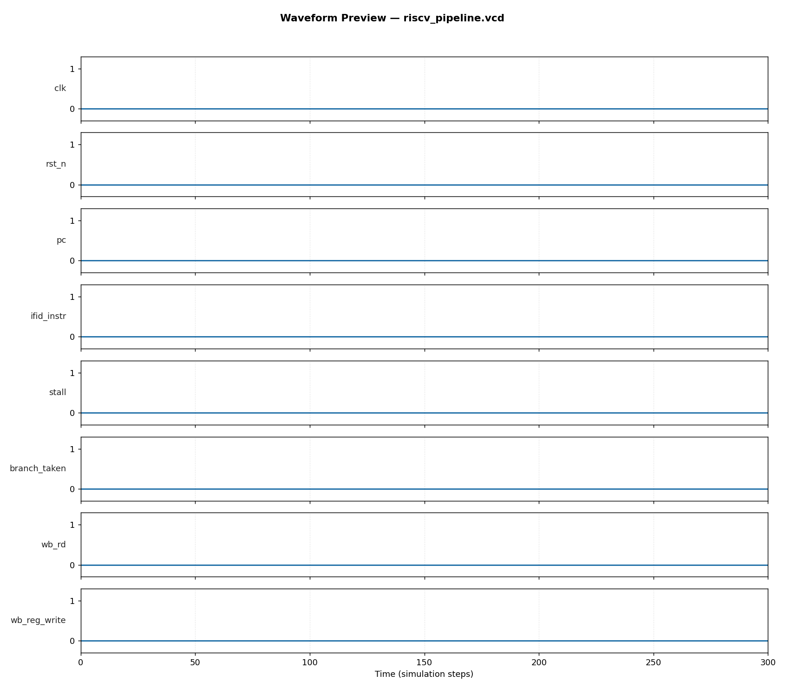

# 5-Stage Pipelined RISC-V Processor (RV32I subset) — RTL Design & Verification

**Author:** Abhijit Karale
**Tools used:** SystemVerilog (IEEE 1800-2012), Icarus Verilog 12.0, Python (custom RV32I encoder + waveform post-processing)

## Overview
A classic 5-stage pipelined processor (IF → ID → EX → MEM → WB) implementing
a functional RV32I instruction subset, with the two hazard-handling
mechanisms that separate a "toy pipeline" from a working one:

- **Data hazards:** full operand forwarding from EX/MEM and MEM/WB back into
  the EX stage ALU inputs (no unnecessary stalling on ALU-to-ALU dependencies)
- **Load-use hazard:** hardware hazard-detection unit that stalls IF/ID for
  exactly 1 cycle when an instruction needs a register still being loaded by
  a `lw` ahead of it in the pipeline (forwarding alone cannot solve this —
  the data simply isn't ready yet)
- **Control hazards:** branches (`beq`) resolved in the EX stage, with the
  two speculatively-fetched instructions correctly flushed (squashed) on a
  taken branch

**Instructions supported:** `add`, `sub`, `and`, `or`, `xor`, `slt`, `addi`, `lw`, `sw`, `beq`

## Pipeline Diagram
```
   IF        ID        EX        MEM       WB
 ┌─────┐   ┌─────┐   ┌─────┐   ┌─────┐   ┌─────┐
 │ PC  │──▶│decode│──▶│ ALU │──▶│dmem │──▶│ WB  │
 │imem │   │regfile│  │fwd  │  │r/w  │   │write │
 └─────┘   └─────┘   └──┬──┘   └─────┘   └─────┘
    ▲                    │
    │            branch_taken/target
    └────────────────────┘
         (flush IF/ID, ID/EX on taken branch)

 Hazard unit: ID/EX.mem_read & (ID/EX.rd == ID.rs1 | ID.rs2) ──▶ stall (1 cycle)
 Forwarding unit: EX/MEM.rd / MEM/WB.rd == ID/EX.rs1|rs2 ──▶ bypass into ALU
```

## Verification Approach
A small custom RV32I instruction encoder (`tb/assemble.py`) generates the
test program's machine code (no external toolchain dependency), covering:

1. Back-to-back `addi` (baseline)
2. `add`/`sub` R-type ALU ops with EX-stage forwarding
3. `sw` then `lw` to the same address (memory round-trip)
4. **Load-use hazard:** `add x6, x5, x1` immediately after `lw x5, 0(x0)` — exercises the 1-cycle stall path
5. **Taken branch:** `beq x1, x1, +8` — verifies the following instruction is correctly flushed and never commits (`x7` must remain 0), and that the branch target instruction executes correctly
6. `and`/`or`/`xor`/`slt` — remaining ALU operations

The self-checking testbench (`tb/tb_riscv_pipeline.sv`) runs the program to
completion, then checks the final architectural register file and data
memory state against hand-computed expected values.

**Result: 13/13 checks passed, 0 failures** — including the load-use stall
and branch-flush cases, which are the two hazard scenarios most pipeline
implementations get wrong on the first attempt.

## Waveform


Full interactive waveform: `waveform/riscv_pipeline.vcd` (open with GTKWave or any VCD viewer)
— recommended to also add `stall` and `branch_taken` signals when inspecting
interactively, to see the hazard/flush events directly.

## How to Run
```bash
chmod +x run.sh
./run.sh
```
Requires: `iverilog`, `vvp` (Icarus Verilog), Python 3 with `matplotlib`.
`run.sh` re-runs the assembler first, so editing `tb/assemble.py`'s
`program` list lets you test new instruction sequences immediately.

## Repository Structure
```
05_riscv_pipeline/
├── rtl/riscv_pipeline_top.sv   # 5-stage pipeline RTL (regfile, ALU, hazard/fwd units, imem/dmem)
├── tb/
│   ├── assemble.py             # minimal RV32I instruction encoder
│   ├── imem.hex                # assembled test program (machine code)
│   └── tb_riscv_pipeline.sv    # self-checking testbench
├── waveform/                   # VCD + PNG waveform preview
├── vcd_plot.py                 # waveform plotting utility
└── run.sh                      # one-command assemble+build+sim+plot
```

## Skills Demonstrated
`SystemVerilog` `RTL Design` `RISC-V (RV32I)` `Pipelined Microarchitecture`
`Hazard Detection & Forwarding` `Functional Verification` `Computer Architecture`
